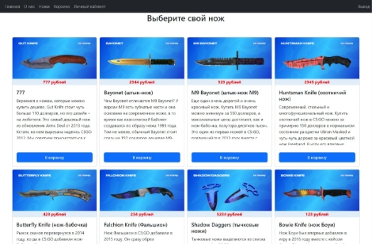

**Техничка:**

1. ` `**Frontend:** VueJs
1. ` `**Backend:** laravel
1. ` `**Дизайн:** Bootstrap
1. ` `**Функционал:** Регистрация/Авторизация пользователей (Sanctum. Tokens), Корзина (Добавление/Удаление ножей, если несколько раз нажать "Добавить" то количество в корзине увеличится), просмотр каталога ножей, Добавление новых ножей в каталог включая изображение. Использовал: Laravel, VueJs, Vue-router, Sanctum, axios (async), bootstrap, MySQL, git. SPA, проект развернул на VPS сервере.
1. **Код проекта: [GitHu**](https://github.com/ramik1990/felixTest)**
1. **Демо: [Demo-Site**](http://77.243.80.92:83/)**
1. **Описание работы:** времени потрачено не больше 6 часов (именно работы), удалось решить минимальный функционал (авторизация/регистрация, просмотр каталога ножей, добавление новых ножей в каталог, добавление/удаление ножей в корзине. Трудностей особо не возникало. Имея большее количество времени можно довести до ума весь проект.
1. **Примерный тайминг:** не больше 6 часов
